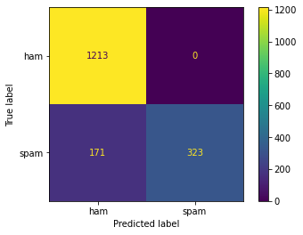
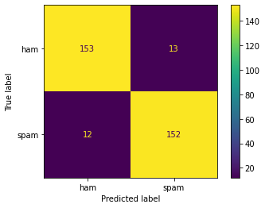
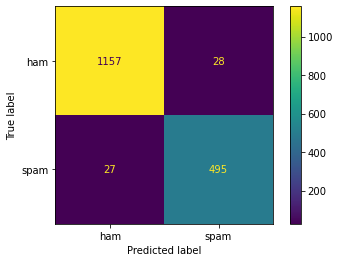
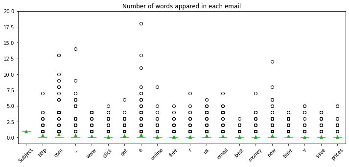

Final Project Summary Report

Author: *Zijun Yi*

Course: IST 664

## Project introduction

This project is for course IST 664 Natural Language Processing. I pick one of the the three data set, The Enron Public email corpus. It's labeled with `Spam` and `Ham`. I am going to use package `NLTK`, `regex` and `Sklearn` to create Navies Bayes Classification model to analysis and classify Spam email and non-Spam email.

I also created a public github repo, which contains all the code and data:

*https://github.com/zyi103/ist664-spam-detection*

### Data Exploration

The dataset contains 3672 ham(non-Spam) email, and 1500 Spam email. 

```python
print('number of email in ham folder: ',len(os.listdir('ham')))
print('number of email in spam folder: ',len(os.listdir('spam')))  
```

`number of email in ham folder:  3672`
`number of email in spam folder:  1500`

## Data Processing/Cleaning 

The assignment come with a brief template, which includes a function that read the file from the local directory. There is problem with how it picked documents between Spam and Ham, which I will address later.

First we are going to used the `word_tokenizer` from `NLTK` package, which will create a bag-of-words here we will call it `tokens`. Next step will be filter out the numbers, punctuation and function words. We will use the `regex.sub` function for filtering numbers and punctuations, and `nltk.stopwords` for function words. Below is an example for Spam email, and we will do the same for Ham.

```python
# use regex to filter now word phares
regex = re.compile('[\W+]|[\d+]')        
stop_words = set(stopwords.words('english')) 
    
# create list of mixed spam and ham email documents as (list of words, label)
emaildocs = []
# add all the spam
for spam in spamtexts:
    tokens = nltk.word_tokenize(regex.sub(' ',spam))
    clean_tokens = [w for w in tokens if not w in stop_words]
    emaildocs.append((clean_tokens, 'spam'))
```


## Feature engineering

For this Spam filter, I would like to use the method of TF-IDF, which stand for term frequency–inverse document frequency. To be able to do that we will need to actualizes the words into counts then calculate the term frequency and compare it to the document frequency. 
$$
{\displaystyle \mathrm {tf} (t,d)={\frac {f_{t,d}}{\sum _{t'\in d}{f_{t',d}}}}}
$$
It's a lot of process, but luckily we will be able to under the `sklearn` package which come with the process predefined. However, in the homework we are asked to not use the Vectorizor from `klearn`. There for we are going to write a function that does that. The function `processspamham()` will return a panda data frame that contains the vector and labels. We will use that and create a directory called features and add count all the tokens. 


```python
def vectorize(tokens):
    features = defaultdict(int)
    for token in tokens:
        features[token] += 1
    return features
   
def vectorlizedspamham(spam_limit = 1500, ham_limit = 3672):
    emails = processspamham(spam_limit, ham_limit)
    vector = map(vectorize, emails.tokens.tolist())
    return pd.DataFrame(vector).fillna(0), emails.label.tolist()  
```

Next we will feed it into the `sklearn` pipeline, which have two steps the `TfidfTransformer` and `MultinomialNB`, which is the Naive Bayes Classifier. 

```python
Pipeline([('tfidf', TfidfTransformer()),
          ('nbc', MultinomialNB())]).fit(X_train,y_train)
```


## Data Modeling 

The first model I used all the data, 

`number of email in ham folder:  3672`
`number of email in spam folder:  1500`

We got an accuracy of .90, but for a spam filter, what we want to look at is the recall.

                  precision    recall  f1-score   support
    
             ham       0.88      1.00      0.93      1213
            spam       1.00      0.65      0.79       494
    
        accuracy                           0.90      1707
       macro avg       0.94      0.83      0.86      1707
    weighted avg       0.91      0.90      0.89      1707



For Ham we got 1.00 and for Spam we got 0.65. We achieved 0 false negative, which is impressive. The Spam filter is not that accurate at detecting Spam, but it's really good at finding Ham email. Therefore, base on this test hot of 1700 emails we didn't get any false negative. This also means if there is an important email we are not gonna accidentally classify it as Spam.


There is one interesting thing I have noted while editing the preprocessing function given with the homework. The function will take a limit which apply to both `spam` and `ham` emails. This would make sense if we are trying to save processing power. However we also will run in to problems like different distribution of the input data. Naturally the number of Spam we get will be much lesser than real emails. 1500/3672, in this case. If we manipulate the ratio, the model won't be less accurate in real production environment. Here is an example from `vectorlizedspamham(500,500)`  a total of 1000 email with half Spam and half ham:

                  precision    recall  f1-score   support
    
             ham       0.93      0.92      0.92       166
            spam       0.92      0.93      0.92       164
    
        accuracy                           0.92       330
       macro avg       0.92      0.92      0.92       330
    weighted avg       0.92      0.92      0.92       330




Although the accuracy is higher with 0.92, the recall on ham had decreased, which means there is a 8% chance we mis-classify a good email in Spam. This seems too high of a error rate. Next just to demonstrate the problem of changing the ratio on the train set we are going to use the model we just trained for above plot:

                  precision    recall  f1-score   support
    
             ham       0.98      0.98      0.98      1185
            spam       0.95      0.95      0.95       522
    
        accuracy                           0.97      1707
       macro avg       0.96      0.96      0.96      1707
    weighted avg       0.97      0.97      0.97      1707

​    



   

Also one important things I have realized is that words like Subject, To, CC, etc., which come with all the e-mails. Would be included in all the documents. Like the table below, All the email starts with Subjects, I could filter them out using regex in data cleaning. However, since we are going to use the TF-IDF method, all subject will have the equal number and end up with 0. 

<table border="1" class="dataframe">
  <thead>
    <tr style="text-align: right;">
      <th></th>
      <th>tokens</th>
      <th>label</th>
    </tr>
  </thead>
  <tbody>
    <tr>
      <th>0</th>
      <td>[Subject, list, dirty, list, let, know, lookin...</td>
      <td>ham</td>
    </tr>
    <tr>
      <th>1</th>
      <td>[Subject, epgt, gloria, difference, two, pipes...</td>
      <td>ham</td>
    </tr>
    <tr>
      <th>2</th>
      <td>[Subject, cornhusker, plants, become, external...</td>
      <td>ham</td>
    </tr>
    <tr>
      <th>3</th>
      <td>[Subject, free, report, euro, tells, gain]</td>
      <td>spam</td>
    </tr>
    <tr>
      <th>4</th>
      <td>[Subject, eastrans, nomination, change, effect...</td>
      <td>ham</td>
    </tr>
    <tr>
      <th>...</th>
      <td>...</td>
      <td>...</td>
    </tr>
    <tr>
      <th>995</th>
      <td>[Subject, ad, felt, stiffen, goo, hair, face, ...</td>
      <td>spam</td>
    </tr>
    <tr>
      <th>996</th>
      <td>[Subject, urgent, reply, overseas, stake, lott...</td>
      <td>spam</td>
    </tr>
    <tr>
      <th>997</th>
      <td>[Subject, dating, service, nauuughty, minded, ...</td>
      <td>spam</td>
    </tr>
    <tr>
      <th>998</th>
      <td>[Subject, may, activity, survey, daren, please...</td>
      <td>ham</td>
    </tr>
    <tr>
      <th>999</th>
      <td>[Subject, cancel, payment, n, dear, paliourg, ...</td>
      <td>spam</td>
    </tr>
  </tbody>
</table>
<p>1000 rows × 2 columns</p>


## Conclusion

Here we will list all the highest coefficient for all the words. Although we have Subject on top, it would not effect anything in the result, each email will contain one subject as we can see from the data frame above. However, it would be a problem if we are trying to predict an email that someone typed the exact word "Subject" in the message. We will end up with a count of 2 "Subject", and this might cause the classifier the think it's a Spam.

The important features are "http", "com", "www". These are the link someone trying to get people to click on. This is interesting because now the website should start with "https" protocol. This means that there might be some phishing attack going on in the Spam. This is a big security risk for the company. After the website link tokens are the word "click", and it seems like the hackers are trying to get them click on the links.


    	-7.0714	Subject        
    	-7.3682	http           
    	-7.5554	com            
    	-7.6032	_              
    	-7.7624	www            
    	-7.8423	click          
    	-7.8490	get            
    	-8.0086	e              
    	-8.0665	online         
    	-8.0987	free           
    	-8.1242	r              
    	-8.1465	us             
    	-8.1589	email          
    	-8.1598	best           
    	-8.1863	money          
    	-8.2063	new            
    	-8.2174	time           
    	-8.2479	v              
    	-8.2505	save           
    	-8.3105	prices         

Last this is a graph on how often each words appears in the email, and I'm also checking the if there is a big difference on the counts distributed for the top words. My conclusion is there is not a big difference on each words, most of them appeared less than one time in averages, other then the word "subject".



    


